# Concurrency vs Dispatchers in StreamWeld

This document explains the difference between **Concurrent Pipelines** and **Dispatchers** in StreamWeld, two powerful but distinct concepts that are often confused.

## 🔄 Concurrent Pipelines

**Purpose**: Run source and sink in parallel to prevent blocking

### Architecture


### When to Use

- **I/O bound operations**: File reads/writes, network calls, database operations
- **Mismatched speeds**: Fast source, slow sink (or vice versa)
- **Preventing blocking**: Don't want source to wait for sink

### Example

```rust
let source = FileSource::new("large_file.txt");
let sink = DatabaseSink::new(connection);

let pipeline = ConcurrentPipeline::new(source, sink)
    .buffer_size(100)  // Buffer up to 100 items
    .max_concurrency(4);

pipeline.run().await?;
```

## 📡 Dispatchers

**Purpose**: Route items from one source to multiple sinks

### Architecture


## Dispatcher Types

### 1. Broadcast Dispatcher (Fan-out)

**Every item goes to ALL sinks**


**Use cases**: Logging, metrics collection, notifications

```rust
let dispatcher = DispatchedPipelineBuilder::new().broadcast();

dispatcher.subscribe_sink(logger_sink, None).await?;
dispatcher.subscribe_sink(metrics_sink, None).await?;
dispatcher.subscribe_sink(alert_sink, None).await?;
```

### 2. Demand Dispatcher (Load Balancing)

**Items go to sink with highest demand/capacity**


**Use cases**: Work distribution, scaling, load balancing

```rust
let dispatcher = DispatchedPipelineBuilder::new().demand();

dispatcher.subscribe_sink(fast_worker, None).await?;
dispatcher.subscribe_sink(slow_worker, None).await?;
```

### 3. Partition Dispatcher (Sharding)

**Items routed by hash function to maintain order per key**

```mermaid
graph TD
    subgraph "Partition Dispatcher"
        A3["Source"] --> B3["Dispatcher<br/>(Hash Router)"]
        B3 --> C3["Even Sink<br/>(Partition: even)"]
        B3 --> D3["Odd Sink<br/>(Partition: odd)"]

        F3["Item: 42"] --> G3["Hash(42) → even"]
        H3["Item: 43"] --> I3["Hash(43) → odd"]
    end

    style B3 fill:#fce4ec
    style C3 fill:#e3f2fd
    style D3 fill:#fff3e0
```



**Use cases**: Data partitioning, maintaining order per key, sharding

```rust
let partitions = vec!["even".to_string(), "odd".to_string()];
let dispatcher = DispatchedPipelineBuilder::new()
    .partition(partitions, |item: &i32| {
        if item % 2 == 0 { "even".to_string() } else { "odd".to_string() }
    });

dispatcher.subscribe_sink(even_sink, Some("even".to_string())).await?;
dispatcher.subscribe_sink(odd_sink, Some("odd".to_string())).await?;
```

## 💡 Combining Both

You can combine concurrent pipelines and dispatchers for maximum power:


```rust
// Create a concurrent pipeline that feeds a dispatcher
let source = FastSource::new();
let dispatcher = DispatchedPipelineBuilder::new().broadcast();

// Subscribe multiple sinks to the dispatcher
dispatcher.subscribe_sink(logger_sink, None).await?;
dispatcher.subscribe_sink(metrics_sink, None).await?;

// Create dispatcher sink for the concurrent pipeline
let dispatcher_sink = dispatcher.create_sink(10);

// Run with concurrency AND dispatching
let pipeline = ConcurrentPipeline::new(source, dispatcher_sink)
    .buffer_size(50)
    .max_concurrency(4);

pipeline.run().await?;
```

## 🎯 Real-World Examples

### Concurrent Pipeline Examples

- **Web Scraper**: Fast HTML fetching → Slow content parsing
- **Log Processor**: Fast log reading → Slow database writes
- **File Converter**: Fast file reading → Slow format conversion

### Dispatcher Examples

- **Order Processing**: Order → [Payment, Inventory, Email, Analytics]
- **Log Aggregation**: Log entry → [File writer, Metrics, Alerts, Search index]
- **Event Streaming**: Event → [Multiple microservices, databases, caches]

## 📊 Performance Characteristics

| Feature          | Concurrent Pipeline       | Dispatcher                       |
| ---------------- | ------------------------- | -------------------------------- |
| **Purpose**      | Source ↔ Sink parallelism | One-to-many routing              |
| **Concurrency**  | 2 tasks (source + sink)   | N+1 tasks (dispatcher + N sinks) |
| **Buffering**    | Between source and sink   | Between dispatcher and each sink |
| **Backpressure** | Unified                   | Per-sink                         |
| **Use Case**     | I/O optimization          | Fan-out patterns                 |

## 🚀 Getting Started

Check out the examples:

- `cargo run --example concurrency_vs_dispatch` - Interactive comparison
- `cargo run --example concurrent` - Concurrent pipeline examples
- `cargo run --example dispatcher` - Dispatcher examples

## 📚 API Reference

### Concurrent Pipeline

- `ConcurrentPipeline::new(source, sink)` - Create concurrent pipeline
- `.buffer_size(n)` - Set buffer size between source and sink
- `.max_concurrency(n)` - Set maximum concurrent operations
- `.run()` - Execute the pipeline

### Dispatchers

- `DispatchedPipelineBuilder::new()` - Create dispatcher builder
- `.broadcast()` - Create broadcast dispatcher
- `.demand()` - Create demand-based dispatcher
- `.partition(partitions, hash_fn)` - Create partition dispatcher
- `.subscribe_sink(sink, partition)` - Add sink to dispatcher
- `.create_sink(batch_size)` - Create dispatcher sink for pipelines
